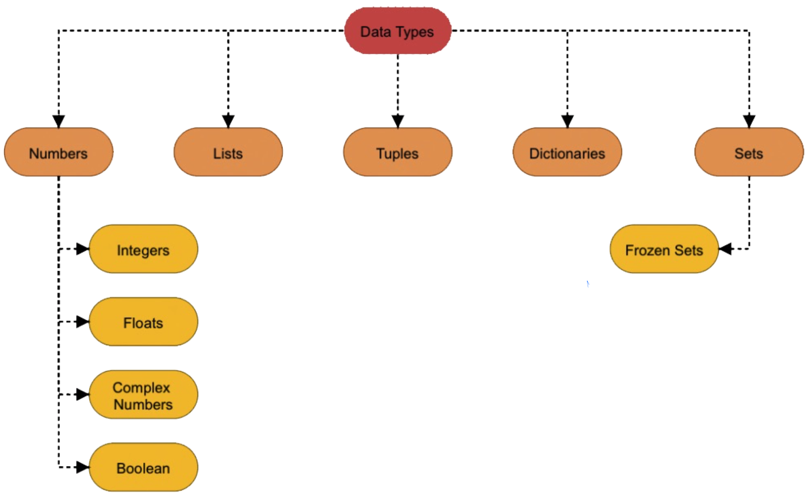

# Data Types

Python supports the following data types.



## Numbers

## Lists

* Lists are ordered sequences of items and each item in the lists can be of any type.
* Lists in Python are Mutable i.e., items in lists can be changed.
* Declaring a list is pretty simple by separating all the list items with commas and enclosed them in square brackets `[]`.  _\(check the below line of code\)_

```python
list1 = [1, 3.5, 5+6j, "Python"]
```

* A list can be nested inside a list. _\(check the below line of code\)_

```python
list2 = [1, 4.4, ["Python", "Hello",]]
```

### Accessing List's Elements 

* Lists are ordered structure, so the items inside the list can be accessed using their indices.
* Lists indices in Python starts with `0`.  
* To get an item in a list use a square bracket along with the item's index. _\(check the code given below\)_

```python
list1 = [1, 3.5, 5+6j, "Python"]

print("1st item in list1 : ", list1[0])
print("2nd item in list1 : ", list1[1])
print("3rd item in list1 : ", list1[2])
print("4th item in list1 :" , list1[3])
```

* Python also allows negative indexing.

## Tuples

## Strings

## Dictionaries

## Sets


