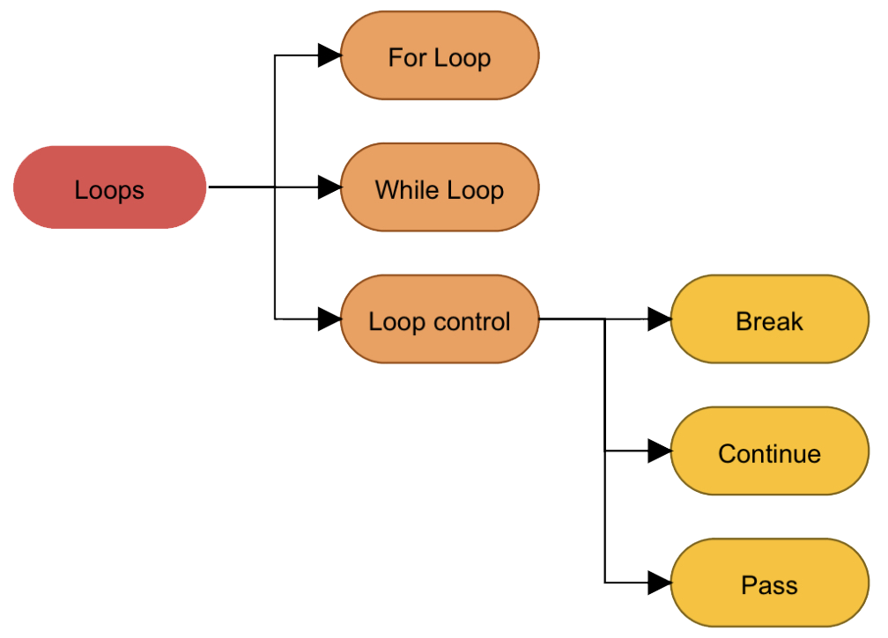

# Loops & Loop Control Statements

Generally, statements are executed sequentially but if you want to run a statement or block of statements for number of times the we need to used loop. 

We can also control the flow of loop execution using loop control statements as we will have a houch of them in this post.

## for Loop

## while loop

## Loop Control Statements

### break

### continue

### pass

