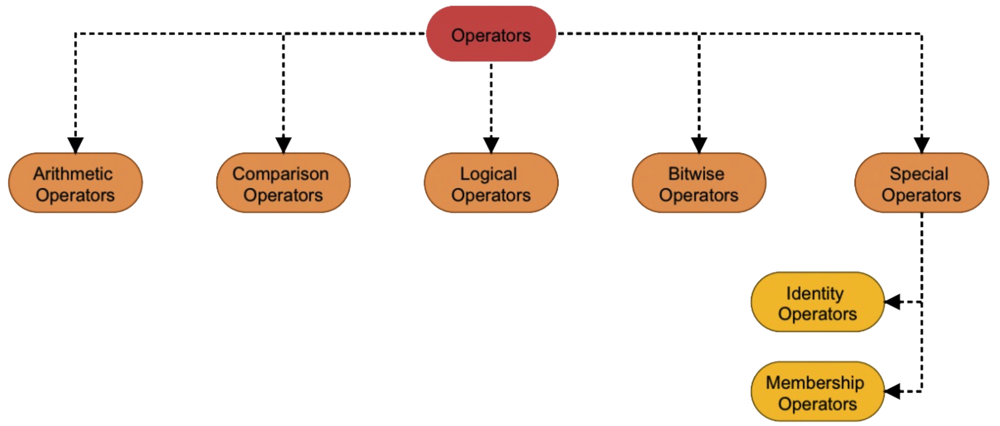

# Operators

### Arithmetic Operators

| Operator |                                                     Description | Example |
| :---: | :--- | :---: |
| + | Adds operands on either side of the operator | 3 + 2 = 5 |
| - | Subtracts right operand from the left operand | 5 - 2 = 3 |
| \* | Adds operands on either side of the operator | 2 \* 3 = 6 |
| / | Perform division operation. The result is a `Float` value | 12 / 5 = 2.4 |
| % | Performs modulo division. This will give us the Remainder | 7 / 4 = 3 |
| // | Performs Floor division. It returns the quotient if both the operands are positive.  If any of the operands is negative then it returns the floor value. i.e., rounded away from zero \(towards the infinity\) | 7//2 = 3 and 7.0//2.0 = 3.0, -11//3 = -4, -11.0//3 = -4.0 |
| \*\* | Power | 2 \*\* 3 = 8 |

### Comparison Operators

### Logical Operators

### Bitwise Operators

### Assignment Operators

### Special Operators

