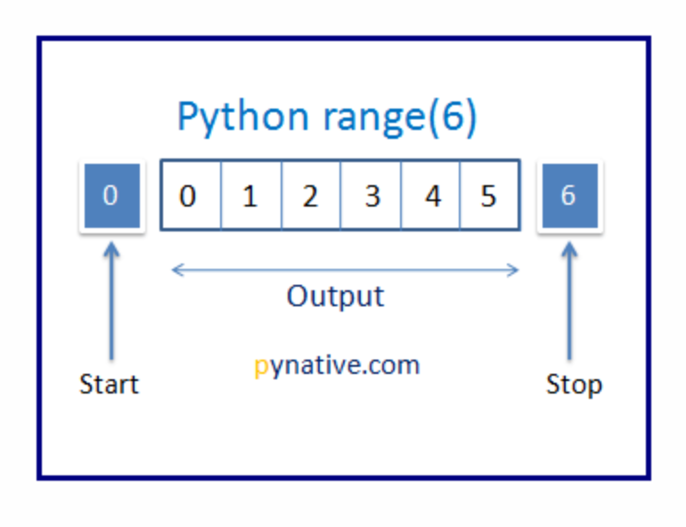

# range\( \)

`range()` is a built-in function that is used to generate a sequence of numbers between the specified start and stop numbers.

By default, it will start with 0 and increments by 1, and stops a number before the specified number. we will understand it in more detail along with examples.

## Syntax

`range(stop)`

`range(start, stop)`

`range(start, stop, step_size)`

| `Parameter` | Description |
| :--- | :--- |
| start | Optional. The Default value is 0. Number to specify the Starting value |
| stop | Required. End number. This number is not included in the sequence. |
| step\_size | Optional. The Default is 1. Number to specify increment or decrement of the sequence. |

`range()` returns a **range** **object**. Typecast to convert from range object to list or tuple or string.


`range()` returns a **range** **object**. Typecast to convert from range object to list or tuple or string.


## Working of `range()` Function

### `range(stop)`

If we passed one argument to `range()` function, it will start the sequence from 0 by default and increments by 1, and end a number before the specified number as shown in the below figure.



#### Example:

```python
#range(stop) example
print("Numbers from 0 to 10 using range() function")
print(list(range(10)))
```

**Explanation:**

**Line 1:** Comment

**Line 2:** Prints 'Numebrs from 0 to 10 using range\(\) function' on console

**Line 3:** range\(\) function will return range object so typecasting the output of range\(\) to list.

**Output :** 

```python
Numbers from 0 to 10 using range() function
[0, 1, 2, 3, 4, 5, 6, 7, 8, 9]
```

### `range(start, stop)`

If we pass `start` and `stop` arguments to the `range()` function then the sequence will begins with `start` value and increments by 1 and ends with a number before the specified number ie., stop value


